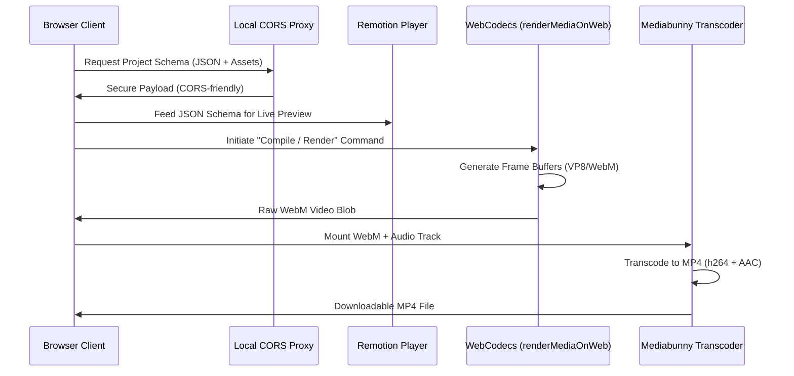

# In-Browser Video Renderer 🎬

An innovative, serverless client-side video composition and rendering pipeline. This application executes dynamic media templates directly within the user's browser, compiling video frames using WebCodecs and converting the resulting WebM stream into an MP4 file with native AAC audio encoding—all without spinning up expensive cloud rendering nodes.

## 🚀 Key Features

- **Decentralized Rendering:** Eliminates server rendering queues and costs by shifting frame compilation to the client's local GPU and CPU.
- **WebCodecs Compilation:** Generates fast, high-quality WebM video blobs in-browser via `@remotion/web-renderer` and WebCodecs (VP8/VP9/AV1).
- **Client-Side Transcoding:** Transparently wraps `mediabunny` inside the browser to transcode raw WebM output into web-standard MP4 formats.
- **Rich Interactive Preview:** Leverages `@remotion/player` for lightweight, hardware-accelerated preview of complex keyframe animations prior to compile.
- **Local API Proxy:** Integrates a lightweight CORS bypass layer to securely fetch external assets, fonts, and project databases in a development environment.

## 🛠️ Execution Pipeline



## 📦 Tech Stack

- **Video Engine:** `@remotion/web-renderer`, `@remotion/player`, `@remotion/media-utils`
- **Transcoder:** `mediabunny` (with WebAssembly-based AAC encoders)
- **Framework:** React 18, TypeScript, Vite
- **State Engine:** Jotai
- **Styling:** Tailwind CSS, PostCSS

## ⚙️ Setup & Installation

This project utilizes Cross-Origin Opener Policy (COOP) and Cross-Origin Embedder Policy (COEP) headers to enable high-performance SharedArrayBuffers required for in-browser video assembly.

```bash
# Clone and enter directory
git clone https://github.com/KhoaTheBest/in-browser-video-renderer.git
cd in-browser-video-renderer

# Install dependencies
yarn install

# Start local server with COOP/COEP headers
yarn dev
```

## 💡 Engineering Highlights & Optimizations

- **High-Performance Memory Buffers:** Configured custom Vite servers with strict COOP/COEP headers, unlocking modern browser memory performance allowing seamless frame buffering.
- **Hardware-Accelerated Encoding:** Detects host WebCodecs support and falls back to progressive canvas-frame captures if high-performance profiles are unavailable.
